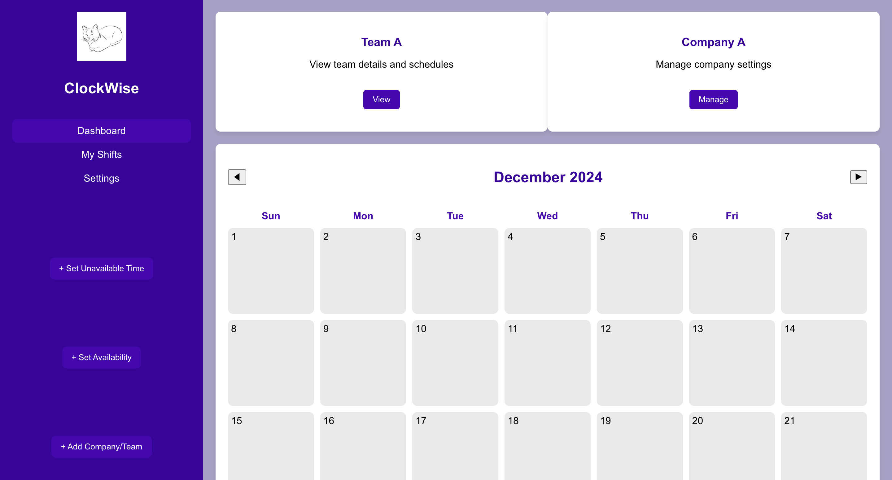

# ClockWise

**ClockWise** is a time management system designed to help businesses and individuals streamline their scheduling processes. It offers a user-friendly interface, real-time notifications, and flexible options for managing availability and bookings.

## Table of Contents
- [Project Overview](#project-overview)
- [Technologies Used](#technologies-used)
- [Installation](#installation)
- [Setup](#setup)
- [Usage](#usage)
- [Contributing](#contributing)
- [License](#license)

## Project Overview

ClockWise aims to address the common challenges in scheduling and time management for both business owners and employees. 
Key features include:
- Easy management of employee availability and shifts.
- Real-time notifications for scheduled events.
- Role-based access for admins, employees, and even for guests.
- A responsive web interface for a seamless user experience.

## Technologies Used
- **Frontend**: React.js, HTML, CSS, JavaScript
- **Backend**: Node.js, Express.js
- **Database**: MongoDB (via Mongoose)
- **Version Control**: Git & GitHub
- **Project Management**: Jira

## Installation

To run this project locally, follow these steps:

Step 1: Run the following command to clone the repository:

git clone https://github.com/JolinaJ/ClockWise.git
cd ClockWise

Step 2: Install the required packages for both the frontend and backend.

Frontend:
cd clockwise/frontend/clockwise-frontend
npm install

Backend:
cd clockwise/backend
npm install

Step 3: Start both the frontend and backend servers.

Frontend:
npm start

Backend:
node server.js

**Usage**

Once both servers are running, you can access the application locally:

Frontend: http://localhost:3000
Backend: http://localhost:3003

Example Scenarios:

Admins can manage company settings and employee shifts

Employees can set their availability and view schedules

Guests can book appointments and view available times

**Contributing**

To contribute:

Fork the repository.

Create a new branch for your feature or bug fix:

git checkout -b feature-name

Commit your changes:

git commit -m "Description of changes"

Push to your branch:

git push origin feature-name

Open a pull request.

